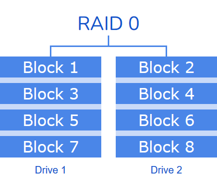
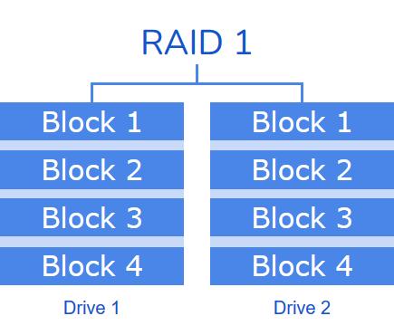

# RAID Levels
RAID (Redundant Array of Independent Disks) is a technology used to combine multiple physical disk drives into a single logical unit for the purposes of data redundancy, performance improvement, or both.
There are several types of RAID configurations.
## RAID 0 (Striping)
**Description:** Data is split across multiple disks.

**Advantages:** Improved performance due to parallelism.

**Disadvantages:** No redundancy; if one disk fails, all data is lost.

**Use Case:** High-performance applications where data loss is not critical.

## RAID 1 (Mirroring)
**Description:** Data is duplicated on two or more disks.

**Advantages:** High redundancy; if one disk fails, data is still available.

**Disadvantages:** Storage capacity is halved; higher cost.

**Use Case:** Critical data storage where reliability is important.

Continued on the [iolloi.icu](https://iolloi.icu/index.php/2024/08/06/raid-levels/)
